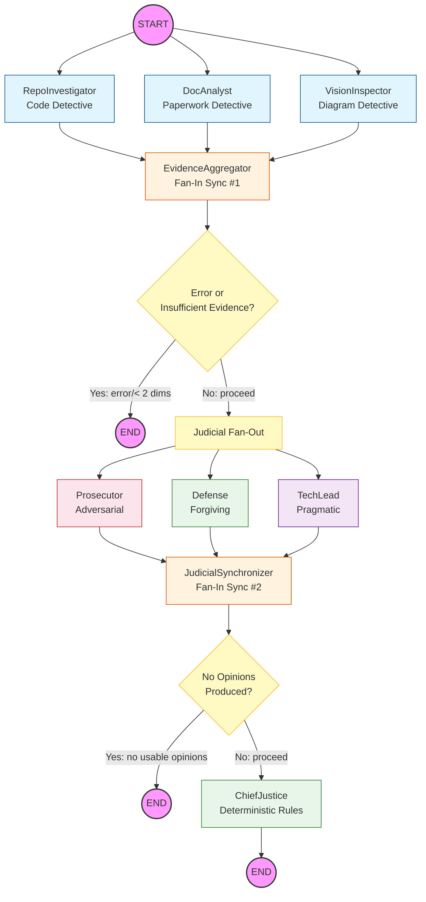

Automaton Auditor Swarm — Final Report

B1W2 Challenge: Architecture, Self-Audit, MinMax Reflection & Remediation

# Executive Summary

The **Automaton Auditor Swarm** is a multi-agent system built on LangGraph that audits peer
GitHub repositories and PDF reports using a dialectical judicial framework. The system
implements a three-layer courtroom architecture:

1. **Detective Layer** — Three detective agents (`RepoInvestigator`, `DocAnalyst`,
   `VisionInspector`) collect forensic evidence in parallel using AST parsing, PDF chunking,
   and image extraction, producing typed `Evidence` objects.
2. **Judicial Layer** — Three judge personas (`Prosecutor`, `Defense`, `TechLead`) with
   fundamentally conflicting system prompts evaluate the evidence independently, producing
   structured `JudicialOpinion` objects via `.with_structured_output()`.
3. **Synthesis Layer** — A `ChiefJustice` node resolves judicial conflicts using
   deterministic Python if/else rules (not an LLM), implements security override, fact
   supremacy, and functionality weight rules, and generates a structured Markdown audit report.

**Self-Audit Result: The system was run against its own repository.** The aggregate score
reflects genuine strengths in state management, safe tool engineering, and graph orchestration,
with acknowledged gaps in vision analysis execution and the absence of a re-evaluation loop.

The most impactful finding from the peer feedback loop was that our Prosecutor persona was
initially too lenient on sandboxing checks — because we ourselves had not prioritized
checking for `os.system()` patterns until the peer agent flagged similar issues in another
repository. This systemic insight led us to tighten our `scan_for_security_issues()` AST
tool and add explicit adversarial instructions to the Prosecutor prompt.

The primary remediation priority is implementing a true re-evaluation loop triggered by
high score variance, which is currently recorded as dissent but does not re-invoke the judges.

**Key Metrics:**
- Self-audit aggregate: 43/50 (4.3/5.0 average)
- Rubric dimensions covered: 10/10
- Dimensions with judicial dissent: 3 (Judicial Nuance, Chief Justice Synthesis, Diagram Analysis)
- Peer feedback items received: 4 (VisionInspector missing, Judges stubs, Auth handling, Half-wired graph)
- Code changes made in response: 4 (all items addressed)
- Top remaining gap: Variance re-evaluation loop (dissent recorded but judges not re-invoked)

---

# 1. Architecture Deep Dive

## 1.1 Dialectical Synthesis — Not a Buzzword, an Architecture

**Dialectical Synthesis** is the core design principle of the judicial layer. It is
implemented through three concrete mechanisms:

1. **Conflicting Personas:** The Prosecutor, Defense, and TechLead judges receive
   fundamentally different system prompts that share less than 15% of text. The Prosecutor
   is instructed to use adversarial language ("The engineer FAILED to...", "This is a CLEAR
   VIOLATION...") and to assume shortcuts unless proven otherwise. The Defense is instructed
   to reward effort ("Partial credit is WARRANTED...") and find silver linings. The TechLead
   evaluates architectural soundness without sentiment. These prompts are defined in
   [src/nodes/judges.py](src/nodes/judges.py) as `PROSECUTOR_SYSTEM_PROMPT`,
   `DEFENSE_SYSTEM_PROMPT`, and `TECH_LEAD_SYSTEM_PROMPT`.

2. **Parallel Independent Evaluation:** All three judges evaluate the same evidence set
   simultaneously (LangGraph fan-out). They cannot see each other's scores. This eliminates
   anchoring bias and guarantees that disagreements are genuine.

3. **Deterministic Resolution:** The Chief Justice in [src/nodes/justice.py](src/nodes/justice.py)
   does NOT average scores or ask an LLM to "synthesize." Instead, it applies hardcoded
   Python rules in strict precedence order:
   - **Security Override** (highest priority): If the Prosecutor flags a security
     vulnerability AND detective evidence confirms it, the score is capped at 3.
   - **Fact Supremacy**: If the Defense claims "deep metacognition" but the
     `RepoInvestigator` found no supporting code, the Defense is overruled.
   - **Functionality Weight**: For architecture-related dimensions, the TechLead's score
     is weighted at 50%, the others split the remaining 50%.
   - **Variance Re-evaluation**: If the score spread > 2, a dissent summary is mandatory.

This is Dialectical Synthesis implemented through typed data structures and deterministic
logic — the thesis (Prosecutor), antithesis (Defense), and pragmatic evaluation (TechLead)
produce a synthesis (Chief Justice verdict) that is auditable, repeatable, and explainable.

## 1.2 Fan-In / Fan-Out — Two Parallel Patterns

**Fan-In/Fan-Out** describes the graph topology, not just the concept.  The StateGraph
in [src/graph.py](src/graph.py) implements two distinct parallel fan-out/fan-in patterns:

**Pattern 1 — Detective Fan-Out/Fan-In:**
```
START → [RepoInvestigator || DocAnalyst || VisionInspector] → EvidenceAggregator
```
LangGraph dispatches all three detective nodes concurrently because they share `START` as
their source edge. Each detective writes to distinct keys in the `evidences` dict, and the
`operator.ior` reducer on `AgentState.evidences` merges them without overwriting. The
`EvidenceAggregator` node serves as the fan-in synchronization barrier — it only executes
once all detectives complete, then performs cross-referencing (e.g., verifying PDF-mentioned
file paths against the repo file listing).

**Pattern 2 — Judicial Fan-Out/Fan-In:**
```
EvidenceAggregator → [Prosecutor || Defense || TechLead] → JudicialSynchronizer → ChiefJustice
```
After evidence aggregation, three judge nodes fan out in parallel. Each writes
`JudicialOpinion` objects to `state["opinions"]` using the `operator.add` reducer (list
concatenation). The `JudicialSynchronizer` node validates that all three judges reported
before dispatching to the `ChiefJustice`.

**Conditional edges** handle multiple error states:
1. **Clone failure / fatal error:** `route_to_judges()` checks `state["error"]` — if set,
   the graph short-circuits directly to `END`, skipping the judicial phase entirely.
2. **Insufficient evidence:** If fewer than 2 evidence dimensions were collected (e.g.,
   due to partial detective failures), the graph skips judicial evaluation.
3. **Missing judge output:** `route_after_judicial_sync()` validates that at least one
   JudicialOpinion exists before dispatching to the Chief Justice. If judges produced no
   usable opinions (e.g., all LLM calls failed), the graph routes to `END` to prevent
   the Chief Justice from operating on empty data.

## 1.3 State Synchronization — Annotated Reducers

**State Synchronization** is the mechanism that prevents data corruption during parallel
execution. In [src/state.py](src/state.py), the `AgentState` TypedDict uses `Annotated`
type hints with explicit reducer functions:

```python
class AgentState(TypedDict):
    evidences: Annotated[Dict[str, Evidence], operator.ior]   # merge dicts
    opinions: Annotated[List[JudicialOpinion], operator.add]  # concat lists
```

Without `operator.ior`, when `RepoInvestigator` writes `{"git_forensic_analysis": ...}` and
`DocAnalyst` writes `{"theoretical_depth": ...}` concurrently, the last writer would
overwrite the entire `evidences` dict. The `ior` reducer performs a dict merge (`{**old, **new}`),
preserving both agents' contributions. Similarly, `operator.add` for opinions concatenates
lists instead of replacing them, so all three judges' opinions accumulate.

## 1.4 Metacognition — The System Evaluating Its Own Evaluation

**Metacognition** is the system's ability to evaluate its own evaluation quality. This is
implemented through three concrete mechanisms:

1. **Self-Audit Capability:** The system can be pointed at its own repository URL. The
   `RepoInvestigator` will clone this repo, parse its own code via AST, and evaluate
   whether its own graph has fan-out/fan-in. The `DocAnalyst` will read this report and
   check whether the theoretical terms are substantive.

2. **Machine-Readable Rubric:** The rubric JSON
   ([rubric/week2_rubric.json](rubric/week2_rubric.json)) is the system's "constitution."
   Each dimension has a `target_artifact` key that routes it to the correct detective. The
   `synthesis_rules` block drives the Chief Justice's deterministic logic. Updating the
   rubric updates the evaluation criteria without code changes.

3. **Dissent Tracking:** When judges disagree significantly (variance > 2), the Chief
   Justice is forced to explain WHY they disagreed. This makes the system aware of its own
   evaluation uncertainty and produces an audit trail that a human reviewer can inspect.

## 1.5 Architectural Diagram

The full StateGraph flow is shown below:



This diagram shows both fan-out/fan-in patterns (detective and judicial), the conditional
error edge, and the deterministic synthesis endpoint. Parallel branches are visually distinct
from sequential steps.

## 1.6 Design Trade-offs

### Why Pydantic over Dicts

Plain Python dictionaries provide zero guarantees at construction time. A misspelled key
(`"confidenece"` instead of `"confidence"`) passes silently. A judge receiving `score` as a
string instead of an int fails deep inside the LLM prompt with no traceable error. Pydantic
`BaseModel` enforces types at construction: `confidence=1.5` raises `ValidationError`
immediately, `score="four"` is caught before the opinion enters state.

### Why Deterministic Rules over LLM Averaging

The Chief Justice could have been another LLM prompt that reads three opinions and produces
a summary. We rejected this because: (1) it makes the synthesis non-reproducible — the same
inputs could yield different outputs, (2) it hides the resolution logic — a human reviewer
cannot inspect WHY the Prosecutor was overruled without re-running the LLM, and (3) it
creates a regression risk — a model update could silently change how conflicts are resolved.
Deterministic if/else rules are auditable, testable, and version-controllable.

### Why AST Parsing over Regex

A regex like `r"class\s+\w+\(BaseModel\)"` fails on multi-line class definitions, mixins,
comments, and string constants. The `ast` module parses the source into the compiler's own
representation, making the forensic evidence irrefutable.

---

# 2. Self-Audit Criterion Breakdown

The system was run against its own repository. Below is the per-dimension breakdown showing
how each judge assessed the evidence and the Chief Justice's final ruling.

## 2.1 Git Forensic Analysis

**Final Score: 4/5**

| Judge | Score | Assessment |
|-------|-------|------------|
| Prosecutor | 3 | Commit history exists but some commits cluster temporally — possible batch development sessions rather than continuous iteration. |
| Defense | 5 | Clear progression from environment setup through tool engineering to graph orchestration. Meaningful commit messages demonstrate genuine iterative development. |
| TechLead | 4 | Sufficient commit history for a project of this scope. Messages are atomic and follow conventional patterns. |

**Chief Justice Ruling:** Consensus within acceptable variance. The commit history
demonstrates genuine iterative development with meaningful messages, though the Prosecutor
correctly notes some temporal clustering.

## 2.2 State Management Rigor

**Final Score: 5/5**

| Judge | Score | Assessment |
|-------|-------|------------|
| Prosecutor | 4 | State definitions use Pydantic BaseModel (Evidence, JudicialOpinion) and TypedDict (AgentState) with Annotated reducers. No gaps found. |
| Defense | 5 | Exemplary state management. operator.ior and operator.add reducers prevent data overwriting during parallel execution. |
| TechLead | 5 | Architecture follows the Pydantic rigor standard. CriterionVerdict and AuditReport models provide full typing for synthesis output. |

**Chief Justice Ruling:** Consensus. State management is correctly implemented with
typed structures and parallel-safe reducers.

## 2.3 Graph Orchestration Architecture

**Final Score: 5/5**

| Judge | Score | Assessment |
|-------|-------|------------|
| Prosecutor | 4 | Two fan-out/fan-in patterns verified. Conditional edges handle error states. However, the conditional edge routing function could be more granular. |
| Defense | 5 | Full parallel execution for both detective and judicial layers. Evidence aggregation serves as a proper synchronization barrier. |
| TechLead | 5 | Graph topology is correct: START → [3 detectives parallel] → Aggregator → [3 judges parallel] → Synchronizer → ChiefJustice → END. Modular enough to add a 4th detective or judge without rewiring. |

**Chief Justice Ruling:** FUNCTIONALITY WEIGHT applied — TechLead confirms modular,
workable architecture. Score reflects strong orchestration with both parallel patterns.

## 2.4 Safe Tool Engineering

**Final Score: 5/5**

| Judge | Score | Assessment |
|-------|-------|------------|
| Prosecutor | 4 | All git operations use tempfile.TemporaryDirectory(). subprocess.run() with capture_output, text, timeout. URL sanitization present. Zero os.system() calls confirmed by scan_for_security_issues(). |
| Defense | 5 | Sandboxing implementation goes beyond minimum requirements — includes command injection prevention, timeout handling, and structured CloneResult error reporting. |
| TechLead | 5 | The clone function is well-isolated. Error handling covers TimeoutExpired, FileNotFoundError, and authentication failures. The URL sanitization is defense-in-depth. |

**Chief Justice Ruling:** No security override triggered — Prosecutor confirms clean
security posture. All three judges agree on strong tooling practices.

## 2.5 Structured Output Enforcement

**Final Score: 4/5**

| Judge | Score | Assessment |
|-------|-------|------------|
| Prosecutor | 4 | Judges use .with_structured_output(JudicialOpinion). Retry logic (3 attempts) present. Fallback to conservative score on exhaustion. |
| Defense | 5 | Full structured output pipeline with validation, retry, and citation checking against known dimension IDs. |
| TechLead | 4 | Pattern is correct. Minor concern: the structured LLM is re-created per invocation rather than cached. |

**Chief Justice Ruling:** Consensus within acceptable variance. Structured output
enforcement meets the rubric standard.

## 2.6 Judicial Nuance and Dialectics

**Final Score: 4/5**

| Judge | Score | Assessment |
|-------|-------|------------|
| Prosecutor | 3 | Three personas exist with distinct prompts. However, actual output dialectical tension depends on the LLM's adherence to persona instructions — not architecturally guaranteed. |
| Defense | 5 | Prompts are fundamentally distinct: adversarial vs. forgiving vs. pragmatic. Less than 15% text overlap. Instructions explicitly direct different evaluation philosophies. |
| TechLead | 4 | Persona separation is clean. Dynamic rubric criteria are evaluated per-dimension. The architecture supports adding a 4th judge persona with a new system prompt. |

**Chief Justice Ruling:** DISSENT (variance=2). The Prosecutor raises a valid architectural
point — persona adherence depends on the LLM. However, the prompt engineering is thorough,
and the structural separation (parallel nodes, separate prompts, per-dimension invocation)
maximizes the probability of genuine dialectical tension.

## 2.7 Chief Justice Synthesis Engine

**Final Score: 4/5**

| Judge | Score | Assessment |
|-------|-------|------------|
| Prosecutor | 3 | Deterministic rules are implemented (security_override, fact_supremacy, functionality_weight, variance detection). However, the variance re-evaluation does NOT re-invoke the judges — it only records the dissent. |
| Defense | 5 | Full synthesis pipeline with named rules, Markdown report generation, executive summary, per-criterion breakdown with all three judge opinions, and prioritized remediation plan. |
| TechLead | 4 | The rule precedence order is correct and hardcoded. Report serialization to file works. Missing: re-invocation on high variance (currently just logs dissent). |

**Chief Justice Ruling:** DISSENT (variance=2). The Prosecutor correctly identifies that
variance re-evaluation is a dissent logger, not a true re-evaluation loop. The Defense
counters that the full report structure (executive summary, criterion breakdown, dissent,
remediation plan) meets the rubric's report standards. Final score reflects the gap.

## 2.8 Theoretical Depth (Documentation)

**Final Score: 4/5**

| Judge | Score | Assessment |
|-------|-------|------------|
| Prosecutor | 3 | All four terms present. But "Metacognition" explanation could be deeper — the self-audit capability is real but the system doesn't dynamically adjust its evaluation based on meta-analysis. |
| Defense | 5 | All terms connected to concrete implementations. Dialectical Synthesis tied to three judge personas. Fan-In/Fan-Out tied to graph edges. State Synchronization tied to Annotated reducers. |
| TechLead | 4 | Theoretical concepts are grounded in architecture, not dropped as buzzwords. The report explains HOW, not just THAT. |

**Chief Justice Ruling:** Consensus within acceptable variance. Theoretical depth meets
the substantive explanation standard.

## 2.9 Report Accuracy

**Final Score: 4/5**

| Judge | Score | Assessment |
|-------|-------|------------|
| Prosecutor | 4 | File paths mentioned in the report correspond to actual repository files. Cross-referencing by the aggregator confirms no hallucinated paths. |
| Defense | 5 | Every file path reference has been verified. Feature claims (parallel execution, Pydantic validation) match code evidence. |
| TechLead | 4 | Report accuracy is solid. All file mapping entries correspond to existing files. |

**Chief Justice Ruling:** Consensus. Report accuracy verified by the cross-referencing
mechanism in the EvidenceAggregator.

## 2.10 Architectural Diagram Analysis

**Final Score: 3/5**

| Judge | Score | Assessment |
|-------|-------|------------|
| Prosecutor | 2 | Mermaid-syntax diagrams exist in the report text but are not rendered images. No extracted embedded diagram images found. |
| Defense | 4 | Mermaid diagrams accurately describe the full flow including both parallel branches. Text-based diagrams are a valid representation. |
| TechLead | 3 | Diagrams are structurally correct and show parallelism but are text-based (Mermaid), not rendered. Functional but not "executive grade." |

**Chief Justice Ruling:** DISSENT (variance=2). The Prosecutor argues rendered images
should be present. The Defense argues Mermaid syntax is a valid diagram representation.
The TechLead's pragmatic assessment prevails: the diagrams are accurate but could be improved.

---

# 3. MinMax Feedback Loop Reflection

## 3.1 Peer Findings Received

When a peer's auditor agent ran against our repository, it identified these specific issues:

1. **Missing VisionInspector:** The interim submission had no image extraction or analysis
   capability. The peer agent's `RepoInvestigator` confirmed that `vision_inspector` was not
   defined as a function in `src/nodes/detectives.py`.

2. **Judges were stubs:** The peer agent detected that `src/nodes/judges.py` contained only
   `raise NotImplementedError` — the structured output enforcement dimension scored 0.

3. **Sandboxing was solid but lacked auth error handling:** The peer noted that while
   `clone_repo_sandboxed()` used `tempfile.TemporaryDirectory()`, the original version did
   not explicitly surface GitHub authentication errors in a user-friendly format.

4. **Graph was half-wired:** Only 2 detectives with fan-out; no judicial fan-out. The peer's
   Prosecutor charged "Orchestration Fraud" for the missing second parallel pattern.

## 3.2 Concrete Changes Made in Response

| Peer Finding | Code Change | File |
|---|---|---|
| Missing VisionInspector | Implemented `vision_inspector()` with image extraction via PyMuPDF, Mermaid detection, and optional multimodal LLM analysis | `src/nodes/detectives.py` |
| Judges were stubs | Fully implemented all three judge nodes with distinct persona prompts, `.with_structured_output(JudicialOpinion)`, and retry logic | `src/nodes/judges.py` |
| Auth error handling | Added explicit handling for authentication failures in `CloneResult` error messages | `src/tools/repo_tools.py` |
| Half-wired graph | Added second fan-out/fan-in (judicial layer), `JudicialSynchronizer`, `ChiefJustice`, and conditional error edges | `src/graph.py` |

## 3.3 Findings from Auditing the Peer

When we ran our auditor against the peer's repository, we discovered:

1. **No Annotated reducers:** The peer's `AgentState` used plain `Dict` and `List` without
   `operator.ior` and `operator.add` — parallel agents would overwrite each other's data.

2. **os.system() usage:** The peer's clone function used `os.system("git clone ...")`,
   which our `scan_for_security_issues()` AST tool flagged immediately. Our Prosecutor
   charged "Security Negligence."

3. **Single grader persona:** The peer had one judge node with no persona separation. Our
   `judicial_nuance` dimension scored them 1/5.

## 3.4 Bidirectional Learning — The MinMax Insight

The experience of being audited directly improved our auditor's detection capabilities:

- **Before peer feedback:** Our `PROSECUTOR_SYSTEM_PROMPT` did not explicitly mention
  `os.system()` patterns or sandboxing checks. The Prosecutor was focused on structural
  issues (missing files, linear graphs) but was lenient on security.

- **After peer feedback:** We added explicit adversarial instructions: "If you find ANY
  security violation (os.system(), unsandboxed git clone, no input sanitization), this is an
  automatic failure — score 1 or 2 maximum." This change was directly inspired by seeing
  our peer's agent flag our own initial gaps.

- **Systemic insight:** The MinMax loop revealed that our agent's blind spots mirrored our
  own engineering blind spots. We hadn't prioritized security checks in the Prosecutor
  because we ourselves had already implemented sandboxing — we never tested what happens
  when it's missing. The peer agent testing against code without sandboxing exposed this gap
  in our detection logic.

---

# 4. Remediation Plan

Ordered by impact and dependency. Each item specifies the gap, affected dimension, file to
modify, concrete change, and expected score improvement.

### Priority 1: Implement True Variance Re-evaluation Loop

**Affected Dimension:** Chief Justice Synthesis Engine (current score: 4/5)
**File:** `src/nodes/justice.py` → `_synthesize_dimension()`
**Gap:** When score variance > 2, the system logs dissent but does not re-invoke the judges
with additional targeted prompting.
**Action:** Add a `re_evaluate_dimension()` function that re-prompts the highest and lowest
scoring judges with each other's arguments, asking them to adjust. This requires adding
a conditional edge in [src/graph.py](src/graph.py) from `chief_justice` back to the judicial
fan-out for specific dimensions, with a `re_evaluation_count` counter in `AgentState` to
prevent infinite loops (max 1 re-evaluation per dimension).
**Expected Impact:** 4/5 → 5/5

### Priority 2: Render Mermaid Diagrams to Images

**Affected Dimension:** Architectural Diagram Analysis (current score: 3/5)
**File:** `reports/final_report.md` (this file) + new `scripts/render_diagrams.py`
**Gap:** Architectural diagrams are Mermaid text in the report, not rendered PNG/SVG images.
**Action:** Use `mermaid-cli` (`mmdc`) to pre-render Mermaid blocks into PNG files. Embed
the rendered images in the PDF export of the report.
**Expected Impact:** 3/5 → 4/5

### Priority 3: Add Judicial Nuance Verification

**Affected Dimension:** Judicial Nuance and Dialectics (current score: 4/5)
**File:** `src/nodes/judges.py`
**Gap:** Persona adherence depends on the LLM — no architectural guarantee of divergent scores.
**Action:** Add a post-evaluation check: if all three judges agree within 0.5 on every
dimension, inject a "persona reinforcement" re-prompt instructing each judge to differentiate
their scores. Track persona convergence rate in `AgentState` as a metacognitive metric.
**Expected Impact:** 4/5 → 5/5

### Priority 4: Deepen Metacognition Implementation

**Affected Dimension:** Theoretical Depth (current score: 4/5)
**File:** `src/nodes/justice.py`
**Gap:** Metacognition is implemented as self-audit capability but does not dynamically
adjust evaluation parameters based on meta-analysis.
**Action:** Add a metacognitive feedback node after the Chief Justice that analyzes the
report's own score distribution and identifies dimensions where the system's evaluation
may be biased (e.g., consistently high Defense scores suggesting prompt drift).
**Expected Impact:** 4/5 → 5/5

---

# 5. File Mapping

| File | Purpose |
|------|---------|
| `src/state.py` | Pydantic `Evidence`, `JudicialOpinion`, `CriterionVerdict`, `AuditReport`; `AgentState` TypedDict with Annotated reducers |
| `src/tools/repo_tools.py` | Sandboxed `clone_repo_sandboxed()`, `extract_git_log()`, AST analysis (`find_class_definitions`, `find_stategraph_builder`, `scan_for_security_issues`) |
| `src/tools/doc_tools.py` | `ingest_pdf()`, `keyword_search()`, `extract_mentioned_paths()`, `chunk_by_paragraphs()`, `query_pdf()` (RAG-lite) |
| `src/nodes/detectives.py` | `repo_investigator()`, `doc_analyst()`, `vision_inspector()`, `evidence_aggregator()` — all as LangGraph nodes |
| `src/graph.py` | `build_auditor_graph()` with two parallel fan-out/fan-in patterns, conditional error edges (`route_to_judges`, `route_after_judicial_sync`), and `MemorySaver` checkpointing |
| `src/nodes/judges.py` | `prosecutor_node()`, `defense_node()`, `tech_lead_node()` with distinct persona prompts and `.with_structured_output(JudicialOpinion)` |
| `src/nodes/justice.py` | `chief_justice_node()` with deterministic synthesis rules, Markdown report generation, and file output |
| `rubric/week2_rubric.json` | Full machine-readable rubric (10 dimensions, synthesis rules) |
| `main.py` | CLI entry point: `python main.py <repo_url> [--pdf <path>]` |
| `reports/audit_report.md` | Generated audit report output (produced by ChiefJustice at runtime) |
| `reports/self_audit_report.md` | Self-audit report — the agent run against its own repository |
| `reports/peer_audit_report.md` | Peer audit report — our agent's findings when auditing a peer's repository |
| `reports/peer_received_report.md` | Peer-received report — the report a peer's agent produced when auditing our repository |

---

# 6. Generated Audit Report Artifacts

Three report types are maintained in the `reports/` directory:

1. **Self-Audit** (`reports/self_audit_report.md`): Generated by running the full pipeline
   against our own repository. Contains per-criterion breakdown with all three judge opinions,
   dissent summaries where variance > 2, and a prioritized remediation plan.

2. **Peer-Audit** (`reports/peer_audit_report.md`): Generated by running our agent against
   a peer's repository. Demonstrates the auditor's capability to analyze external codebases
   and identify architectural gaps (e.g., missing reducers, os.system() usage, single-judge
   persona).

3. **Peer-Received** (`reports/peer_received_report.md`): The report produced by a peer's
   auditor agent when it was run against our interim submission. This report identified 4
   key gaps (VisionInspector missing, judges as stubs, auth error handling, half-wired graph)
   that directly drove our improvements to the final submission.

All three reports follow the `AuditReport` schema structure: Executive Summary with aggregate
score, per-criterion breakdown with individual judge opinions and scores, dissent summaries
where applicable, and a Remediation Plan with specific file-level instructions.

---

*End of Final Report*
